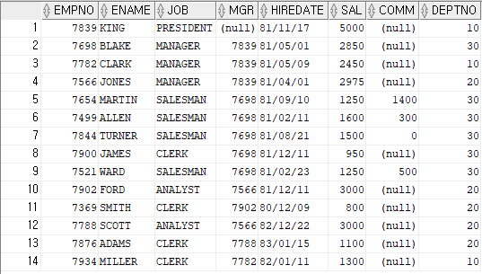
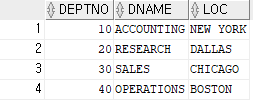

# SQL Example

### 기본 Database

- 사원 테이블
  사원번호, 사원이름, 월급, 직업, 관리자번호, 입사일, 커미션 ,부서번호
  
- 부서 테이블
  부서번호, 부서이름, 위치
  

### 예제

- ex1
  - 사원테이블의 사원 번호와 이름 월급 출력
    `select empno, ename, sal from emp;`
  - 사원테이블의 사원 이름과 직업과 부서번호 출력
    `select ename, job, deptno from emp;`
- ex2
  - 사원 테이블의 모든 열과 데이터 출력
    `select * from emp;`
  - 부서 테이블의 모든 열과 데이터 출력
    `select * from dept;`
- ex3
  - 사원테이블의 사원번호, 이름, 월급의 컬럼명 변경하여 출력
    `select empno as "사원번호", ename as "사원이름", sal as "Salary" from emp;`
  - 이름과 직업을 출력하는데 컬럼명이 한글로 이름, 직업으로 출력
    `select ename as "이름", job as "직업" from emp;`
- ex4
  - 사원테이블의 이름과 월급을 붙여서 출력
    `select ename || sal from emp;`
  - 사원테이블의 이름과 직업을 붙여서 문장으로 출력
    `select ename ||'의 직업은 '|| sal || '입니다' from emp;`
- ex5
  - 직업을 중복행 제거하여 출력
    `select distinct job from emp;`
  - 부서번호를 중복행 제거하여 출력
    `select distinct deptno from emp;`
- ex6
  - 이름과 월급을 출력하는데 월급이 낮은 사원부터(오름차순)
    `select ename, sal from emp order by sal asc;`
  - 이름과 입사일을 출력하는데 최근에 입사한 사원부터(내림차순)
    `select ename, hiredate from emp order by hiredate desc;`
- ex7
  - 월급이 3000인 사원들의 사원이름, 월급, 직업 출력
    `select ename, sal, job from emp where sal = 3000;`
  - 사원번호가 7788인 사원의 사원번호, 사원이름, 월급 출력
    `select empno, ename, sal from emp where empno = 7788;`
- ex8
  - 이름이 scott인 사원의 이름, 월급, 직업, 입사일, 부서번호 출력
    `select ename, sal, job, hiredate, deptno from emp where ename='SCOTT';`
  - 직업이 salesman인 사원들의 이름, 직업, 입사일 출력
    `select ename, job, hiredate from emp where job='SALESMAN';`
  - 81/11/17일에 입사한 사원의 이름, 입사일 출력
    `select ename, hiredate from emp where hiredate='81/11/17';`
